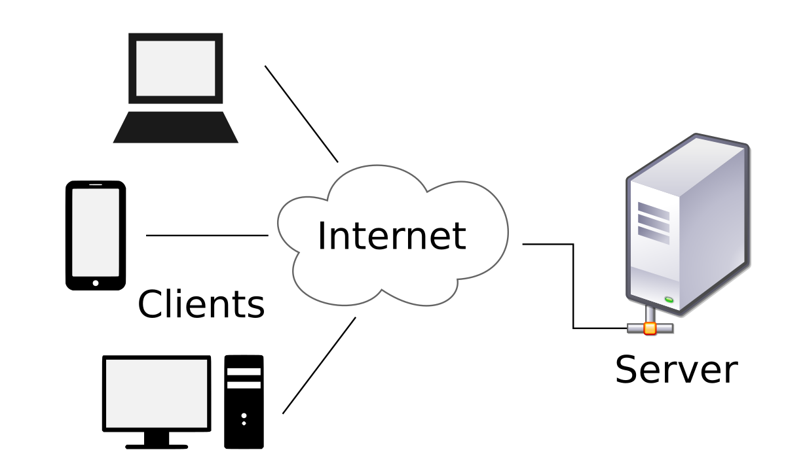

## Basic Interview Question

| No    | Questions                          |
| ------| ------------------------------------------------- |
| 1     | [What is JavaScript? What is the role of JavaScript engine?](#what-is-javascript-what-is-the-role-of-javascript-engine) |    
| 2     |   [What is Client side and Server side?](#what-is-client-side-and-server-side)                                 |    
| 3     |   [What is Scope in Java Script? ](#what-is-scope-in-java-script)                                 |    
| 4     |   [What is the type of a variable in JS when it is declared without using the `var`, `let` and `const`keywords?](#what-is-the-type-of-a-variable-in-js-when-it-is-declared-without-using-the-var-let-and-constkeywords)                                |    
| 5     |   [What is Hositing in Java script?](#what-is-hositing-in-java-script)                                 |    
| 6     |   [What is JSON?](#what-is-json)                                |    
| 7     |                                    |    
| 8     |                                    |    

## What is JavaScript? What is the role of JavaScript engine?
- JavaScript is a programming language that is used for converting static web pages to interactive and dynamic web pages.
- JavaScript engine inside different browsers are:
    - chrome (V8) 
    - Firefox (Spider Monkey)
    - Safari (JavaScript-Core)
    - Edge (Chakra)

- A java-script engine is a program present in web browsers that executes JavaScript code.

## What is Client side and Server side?

- Client: A Client is device, application or software component that requests and conssumes services or resources from a server.

- Server: A Server is device, computer or software component that provides services, resources, or functions to clients.

## What is Scope in Java Script?

## What is the type of a variable in JS when it is declared without using the `var`, `let` and `const`keywords?

## What is Hositing in Java script?

## What is JSON?
